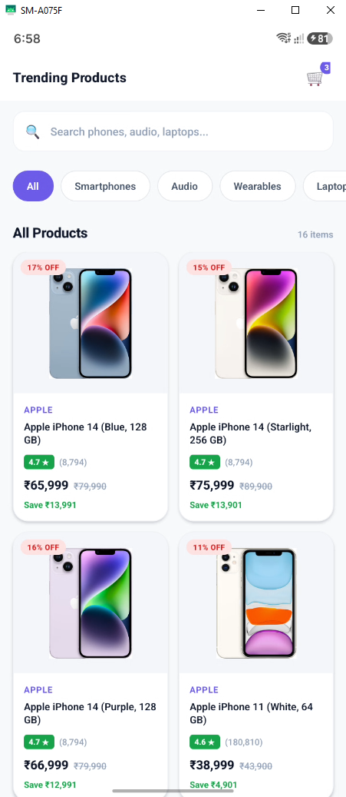
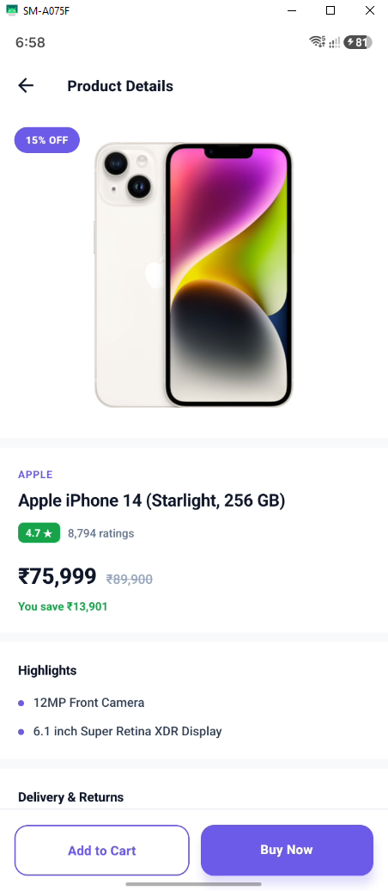

# 🛍️ Shopping App - React Native E-Commerce Store UI

A modern, responsive, and full-featured React Native E-Commerce UI application built with TypeScript, React Navigation Native Stack, category filtering, product rating indicators, discount badge calculations, and detailed product view flows.

Developed as part of a **Mobile App Development & React Native Learning Series**.

---

## 📱 App Screenshots / Demo Preview

<div align="center">

| Trending Products List | Product Details View |
| :---: | :---: |
|  |  |

</div>

---

## ✨ Key Features

- 🛒 **Trending Products Catalog**: Clean FlatList catalog displaying product cards with image preview, ratings, original price vs. discounted price, and discount percentage pills.
- 🏷️ **Category Filter Chips**: Filter products dynamically by category (e.g. Headphones, Audio, Accessories).
- 📦 **Type-Safe Product Navigation**: Passes full product data models (`Product` interface) cleanly across screens using `@react-navigation/native-stack`.
- 🔍 **Rich Product Details Screen**: Includes full product image banners, rating breakdown badges, price savings computation, stock status, specs list, and product tags.
- 🛍️ **Shopping Cart Indicator**: Header integration featuring an interactive cart badge counter component.
- 🎨 **Modern Light Theme & Typography**: Custom theme configuration (`#6C5CE7` primary accent color, clean cards, and smooth slide transitions).

---

## 🛠️ Tech Stack & Tools

- **Framework**: [React Native](https://reactnative.dev/) (v0.87.1)
- **Language**: [TypeScript](https://www.typescriptlang.org/)
- **Navigation Library**: [@react-navigation/native](https://reactnavigation.org/) (v7) & [@react-navigation/native-stack](https://reactnavigation.org/docs/native-stack-navigator/)
- **UI Components**: React Native Core (`FlatList`, `Image`, `Pressable`, `Text`, `View`, `ScrollView`, `StatusBar`), `react-native-safe-area-context`, `react-native-screens`
- **Build Tools**: Metro Bundler, Babel, ESLint, Prettier

---

## 🚀 Getting Started

Follow these instructions to set up and run the application on your local machine or emulator.

### Prerequisites

Ensure your React Native development environment is ready:
- **Node.js**: `>= 22.11.0`
- **npm** or **yarn**
- **Android Studio** (for Android Emulator) or **Xcode** (macOS only, for iOS Simulator)

### Installation

1. **Clone the Repository**
   ```bash
   git clone https://github.com/imtiazaly/Shopping-App-React-Native.git
   cd Shopping-App-React-Native
   ```

2. **Install Dependencies**
   ```bash
   npm install
   ```

3. **Start Metro Bundler**
   ```bash
   npm start
   ```

4. **Run the App**
   - **Android**:
     ```bash
     npm run android
     ```
   - **iOS**:
     ```bash
     cd ios && pod install && cd ..
     npm run ios
     ```

---

## 🧠 Data Architecture & Code Examples

### 1. Product Interface (`src/App.tsx`)
```typescript
export interface Product {
  id: string;
  name: string;
  imageUrl: string;
  originalPrice: number;
  discountPrice: number;
  offerPercentage: number;
  rating: number;
  ratingCount: number;
  tags: string[];
  category: string;
  brand: string;
}

export type RootStackParamList = {
  Home: undefined;
  Details: { product: Product };
};
```

### 2. Header Cart Badge Component
```typescript
const CartIcon = ({ count = 0 }: { count?: number }) => (
  <Pressable style={styles.cartWrap} hitSlop={8}>
    <Text style={styles.cartEmoji}>🛒</Text>
    {count > 0 && (
      <View style={styles.cartBadge}>
        <Text style={styles.cartBadgeText}>{count}</Text>
      </View>
    )}
  </Pressable>
);
```

---

## 📂 Project Structure

```text
Shopping-App-React-Native/
├── assets/                  # App preview screenshots (shop1.PNG, shop2.PNG)
├── src/
│   ├── components/          # Reusable UI components
│   │   ├── CategoryChip.tsx # Category filter chip
│   │   ├── ProductItem.tsx  # Product card item component
│   │   └── Separator.tsx    # List item separator
│   ├── data/
│   │   └── contents.ts      # Mock product dataset & categories
│   ├── screens/
│   │   ├── Home.tsx         # Catalog screen with category filters & FlatList
│   │   └── Details.tsx      # Comprehensive product detail screen
│   └── App.tsx              # Root Stack Navigator & theme setup
├── index.js                 # App entry point
├── package.json             # Project dependencies and scripts
├── tsconfig.json            # TypeScript configuration
└── README.md                # Project documentation
```

---

## 👨‍💻 Learning Objectives

This project was built to explore and implement real-world E-Commerce mobile UI patterns:
- Architecting structured product datasets and TypeScript interfaces.
- Efficient list rendering with `FlatList` and modular card components (`ProductItem`).
- Type-safe object parameter passing across stack screens.
- Crafting clean shopping UI components (rating badges, price comparison, cart counters).

---

## 📄 License

This project is open-source and available under the [MIT License](LICENSE).
